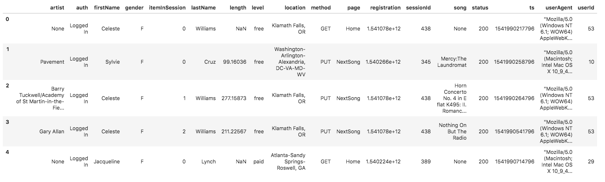

## Datasets

### Song dataset
- **Path**: 's3://udacity-dend/song_data'

- **Description**  
The first dataset is a subset of real data from the Million Song Dataset. Each file is in JSON format and contains metadata about a song and the artist of that song. The files are partitioned by the first three letters of each song's track ID. For example, here are file paths to two files in this dataset.

```
song_data/A/B/C/TRABCEI128F424C983.json  
song_data/A/A/B/TRAABJL12903CDCF1A.json
```

And below is an example of what a single song file, TRAABJL12903CDCF1A.json, looks like.
```
{"num_songs": 1, "artist_id": "ARJIE2Y1187B994AB7", "artist_latitude": null, "artist_longitude": null, "artist_location": "", "artist_name": "Line Renaud", "song_id": "SOUPIRU12A6D4FA1E1", "title": "Der Kleine Dompfaff", "duration": 152.92036, "year": 0}
```
### Log dataset
- **Path**: 's3://udacity-dend/log_data'

- **Description**  
The second dataset consists of log files in JSON format generated by this event simulator based on the songs in the dataset above. These simulate app activity logs from an imaginary music streaming app based on configuration settings. The log files in the dataset you'll be working with are partitioned by year and month. For example, here are file paths to two files in this dataset.
```
log_data/2018/11/2018-11-12-events.json  
log_data/2018/11/2018-11-13-events.json
```
And below is an example of what the data in a log file, 2018-11-12-events.json, looks like.
<center>
  
</center>

## Descriptions of each template

### `sql_queries.py`
SQL queries needed in this project
  1. Drop tables
  2. Create fact and dimension tables
  3. Load the datasets into tables

### `create_tables.py`
Connect to the database. It also drops the tables if it exists, so we can use this function whenever we want to re-create the tables.

### `etl.ipynb`
Structure ETL pipeline and check if it works properly with single JSON file of each dataset

### `etl.py`
If `etl.ipynb` works well, design ETL pipeline for whole datasets

### `test.ipynb`
Check the results of loading data and contraints(PK, NOT-NULL, datatype etc.)

## How to run the Python scripts

1. Complete CREATE and DROP in `sql_queries.py`
2. Run `create_tables.py` with terminal
3. Complete INSERT in `sql_queries.py`
4. Get the dataset and insert values into tables in `etl.ipynb`
5. Check if the tables have proper values in `test.ipynb`
6. Complete `etl.py`
7. Re-run `create_tables.py` and run `etl.py`
8. Same with 4
9. Set constraints and conflict in `sql_queries.py`
10. Check the condition of contraints and conflict

## Database schema design

<center>
  
</center>
